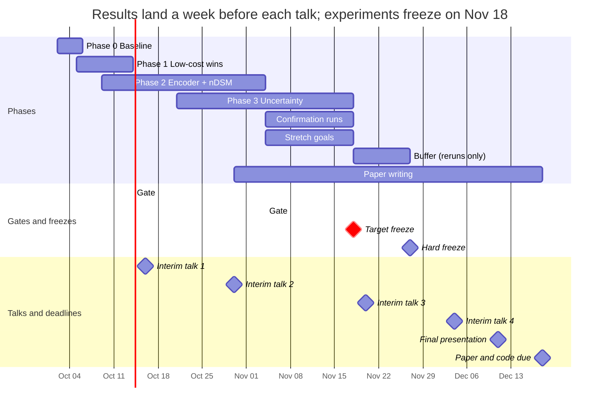

# Neophytes Group F: Project Plan

*Last updated: Oct 2, 2026*

We aim to raise cross-site species F1 over the U-Net + MiT-b2 baseline and to show when the model can be trusted at a new site. Species F1 is the mean F1 of the six target species under 5-fold leave-sites-out cross-validation. We run experiments daily, about one week ahead of each talk: the target freeze is **Nov 18, 2026**, the hard freeze **Nov 27, 2026**, the final presentation **Dec 11, 2026**, and the paper and code are due **Dec 18, 2026**.

## Contents

- [Research questions](#research-questions)
- [Evaluation protocol](#evaluation-protocol)
- [Timeline](#timeline)
- [Daily rhythm](#daily-rhythm)
- [Phase 0 — Reproducible baseline](#phase-0--reproducible-baseline-oct-26)
- [Phase 1 — Error analysis and low-cost improvements](#phase-1--error-analysis-and-low-cost-improvements-oct-514)
- [Phase 2 — Foundation encoder and elevation](#phase-2--foundation-encoder-and-elevation-oct-9nov-4)
- [Phase 3 — Ensembling, uncertainty and calibration](#phase-3--ensembling-uncertainty-and-calibration-oct-21nov-18)
- [Stretch goals](#stretch-goals)
- [Out of scope](#out-of-scope)
- [Compute budget](#compute-budget)
- [Roles](#roles)
- [Paper and presentations](#paper-and-presentations)
- [Risks and fallbacks](#risks-and-fallbacks)
- [Open questions](#open-questions)
- [Sources](#sources)

## Research questions

Our paper answers four research questions (RQs). RQ1–RQ3 target higher F1, and RQ4 targets trust in the model at new sites. Because each RQ compares one change against the same baseline, each yields a result even if the others fail.

| # | Question | Hypothesis | Evidence |
| --- | --- | --- | --- |
| RQ1 | Does a plant-aware foundation encoder improve cross-site F1? | Features learned from about 1.4M Pl@ntNet plant photos separate the target species from similar native plants better than ImageNet features do. | Species and per-class F1 of ImageNet ViT, DINOv3 and PlantCLEF DINOv2, with the decoder held fixed |
| RQ2 | Does elevation (nDSM) improve F1, and for which species? | Height separates trees and shrubs (Ailanthus, Rhus, Buddleja) from herbs (Bunias, Senecio), and it transfers across sites better than colour does. | Per-class F1 with and without nDSM, using the best encoder |
| RQ3 | Do low-cost training and inference changes add up? | TTA, F1-aligned model selection and prior-aware losses mainly improve the rare classes. | An ablation table that adds one change at a time |
| RQ4 | Can the model tell when it is wrong at a new site? | Ensemble disagreement (epistemic uncertainty) flags errors at held-out sites better than single-model softmax entropy does. | Error-detection AUROC, expected calibration error (ECE) and risk–coverage curves on held-out sites |

Our headline result is the 5-fold mean ± spread of species F1 (background excluded), reported overall and per class for both the baseline and our final model.

## Evaluation protocol

All experiments follow the seven rules below. These rules matter because re-running one configuration can shift F1 by several points; a gain therefore counts only if it exceeds seed noise in paired comparisons.

1. **One metric.** We report species F1 (`F1-avg-wo0`: the mean over the six species, background excluded) together with per-class F1. Results come from leave-sites-out CV only; `split_local` serves as a sanity check and never appears as a result.
2. **Two-stage testing.** We test each idea in two stages:
   - Development: two folds (cv3 and cv1, or the two folds with the most rare-class pixels) × 2 seeds, with 512 crops if runs are slow.
   - Confirmation: all 5 folds × 3 seeds, for the baseline, the final model and the paper's ablations only.
3. **Paired comparison.** We compare methods on identical (fold, seed) pairs and report the mean ΔF1 with a 95% interval, from either the Nadeau–Bengio corrected resampled t-test or a bootstrap over the pairs.
4. **Adoption rule, fixed in advance.** We keep a component only if (a) the mean paired ΔF1 is positive, (b) it wins in at least 4 of 5 folds at confirmation, and (c) no species loses more than 3 F1 points. A rare-class gain that leaves overall F1 unchanged also counts, and we report it as such.
5. **Target-aligned model selection.** We select checkpoints by validation species F1 without background instead of the current `val_f1`. Because the validation set comes from training sites, the paper lists this choice as a limitation.
6. **No leakage.** We never ensemble models across folds, since each fold's test sites are training data for the other folds. We never tune on test sites, and we use unlabeled test-site imagery only in the clearly labeled transductive variant (see [Stretch goals](#stretch-goals)).
7. **Logging.** All runs log to one shared W&B project under the name `<idea>_<fold>_s<seed>`. Each run saves its config, and a shared run table tracks its status.

## Timeline



Execution runs about one week ahead of each talk, so each talk reports finished results and the decision that just followed from them. The phases overlap on purpose. After Nov 18, no new experiment starts; the week until Nov 27 serves only as a buffer for reruns and fixes.

## Daily rhythm

Our daily loop keeps the GPU busy every night, so each morning starts from fresh numbers. Talks still take place every two weeks; the daily loop gives us room to react between them.

| When | Task | Owner |
| --- | --- | --- |
| Morning, by 10:00 | Check the overnight runs in W&B, where results already appear because evaluation runs automatically after training; post three lines in Slack: what finished, the numbers, and what comes next | Owner of each run |
| Daytime, code | Build the next change on its own branch and smoke-test it (debug config, about 5 min) before it enters the queue | Workstream owners |
| Daytime, GPU | Run short jobs: smoke tests, frozen-encoder screens, evaluation, and inference-only TTA and calibration | Anyone, through the queue |
| Evening, by 19:00 | Fill the queue until the next morning; on Fridays, fill it for the whole weekend | Queue owner of the day (rotating) |
| Fridays, group slot (before 9:00 or after 10:45) | Review the week against the adoption rule, set next week's queue, and update this plan | Everyone |

**Queue rules:**

- One GPU means one queue: jobs run sequentially from a shared jobs file (task-spooler `tsp`, or a small bash loop in tmux) and are never started by hand in parallel.
- Each training job triggers `test.py` on completion, so the morning starts with numbers rather than with jobs to launch.
- A job enters the queue only with a committed config on its branch and a passing smoke test.
- The queue logs exit codes, so we fix and requeue a crashed run the same morning.
- Development runs (2 folds × 2 seeds) take priority; once a component passes, its 5-fold confirmation runs fill nights and weekends.

## Phase 0 — Reproducible baseline (Oct 2–6)

By Tuesday Oct 6, every group member can run the pipeline, and we know what one baseline run costs. The code fixes come before any experiment, because every later comparison depends on them.

- [ ] Set up the fork, run the smoke test (`data=neophytes_split_debug_1024 model=model_debug`), and obtain W&B access (everyone).
- [ ] Set up the shared GPU queue with automatic evaluation (see [Daily rhythm](#daily-rhythm)).
- [ ] Time one full baseline run on cv3 (wall-clock hours and GPU memory); this number sets the compute budget.
- [ ] Add validation species F1 (background excluded) and use it as the `ModelCheckpoint` monitor.
- [ ] Fix resuming: pass `ckpt_path` to `trainer.fit` so that the optimizer state, epoch and LR schedule are restored.
- [ ] Fix `inference.py` so that it feeds nDSM to elevation models (stem mode currently drops it silently; concat mode crashes).
- [ ] Change `evaluate_cv.py` to use `ddof=1` and to save per-fold, per-seed values for paired tests.
- [ ] Find out whether mask values 254 and 255 mean "uncertain" or "unlabeled"; RQ4 depends on the answer.
- [ ] Train the baseline (MiT-b2, defaults) on both development folds × 2 seeds to obtain a first estimate of seed noise.
- [ ] Agree on directions with Group E to avoid duplicated work.

## Phase 1 — Error analysis and low-cost improvements (Oct 5–14)

Phase 1 first locates the baseline's failures and then tests low-cost fixes aimed at them. Each fix requires at most a config change or about 50 lines of code.

**Error analysis (sets the targets for Phase 2):**

- Confusion matrix: which species the model confuses with background, and which with each other.
- F1 by site, month, phenology stage and patch size; Senecio's many tiny patches are the expected weak spot.
- False positives at held-out sites: which native plants or surfaces trigger them.

**Low-cost changes, each tested alone against the baseline:**

| Change | Rationale | Cost |
| --- | --- | --- |
| Test-time augmentation (8 views: flips and 90° rotations; probabilities averaged) | Nadir images have no "up" direction, so TTA usually gives a small, stable gain for free | Inference code only |
| `mit_b4` encoder | A larger encoder whose config already exists | 1 config |
| Focal + Dice loss, or Lovász-softmax loss | Optimizes an F1- or IoU-like target directly and helps small classes | ~20 lines |
| Logit adjustment (Menon et al. 2021) | Corrects the class prior that weighted sampling shifts; links to calibration in Phase 3 | ~20 lines |
| Per-class bias tuned on validation for F1 | Argmax does not maximize F1; this post-hoc step needs no retraining | Post-processing |
| nDSM fusion, `concat` vs `stem` | Already implemented; gives an early answer to RQ2 | 2 configs |

**Gate (Oct 14):** The changes that pass the adoption rule together form the **strong baseline**, on which Phase 2 builds. If validation F1 plateaus well before epoch 50, we also cut the number of epochs to save compute.

## Phase 2 — Foundation encoder and elevation (Oct 9–Nov 4)

Phase 2 develops our main method and is the most likely source of a large gain. At 2–3 mm GSD, single leaves are visible, so the images resemble close-up plant photos more than satellite imagery; this similarity motivates pretraining on plant photos.

**Candidate encoders (same decoder, same training recipe):**

| Encoder | Pretraining | Role |
| --- | --- | --- |
| ViT-B, ImageNet-supervised (timm) | ImageNet labels | Control that isolates the effect of the pretraining data |
| DINOv3 ViT-B/16 (ViT-L/16 if memory allows) | Self-supervised on web images | Strongest general-purpose dense features; its web-pretrained variant has outperformed the satellite variant on RGB remote sensing |
| PlantCLEF 2024 ViT (`ViTD2PC24All`) | DINOv2, then fine-tuned on about 1.4M Pl@ntNet photos of 7,806 species | Plant-specific features that likely cover all six targets and their native look-alikes; an indirect use of citizen-science data |

**Integration (one person, about one week):**

1. Load the backbone through timm with `dynamic_img_size=True` so that position embeddings interpolate to 1024 crops.
2. Extract features from four evenly spaced blocks and build a ViTDet-style simple feature pyramid (strides 4, 8, 16, 32).
3. Feed this pyramid to an FPN or UPerNet decoder, which preserves the detail of small Senecio patches.
4. Train with LP-FT: first train the decoder for a few epochs with the backbone frozen, then fine-tune the full model with layer-wise LR decay (about 0.75). LP-FT preserves out-of-distribution robustness, which matters at new sites.
5. Use bf16, PyTorch SDPA attention and small batches, and add gradient checkpointing if memory runs out. At test time, run 1024 sliding windows over the 2048 tiles.

**Order of work:**

- Screen all three encoders with frozen backbones on the development folds by Oct 23; this cheap screen ranks the features.
- Fine-tune the top one or two encoders fully.
- Add nDSM to the best encoder by FiLM modulation of the pyramid features, which moves the existing `stem` idea to the pyramid; `concat` would discard the pretrained patch embedding.

**Gate (Nov 4):** If no foundation encoder passes the adoption rule against the strong baseline, the MiT strong baseline + nDSM becomes the final model, and the paper reports RQ1 as a negative result, which remains a valid finding.

## Phase 3 — Ensembling, uncertainty and calibration (Oct 21–Nov 18)

Phase 3 turns the confirmation runs into a deep ensemble at no extra training cost, because these runs already train three seeds per fold. Most of this phase is evaluation code, which starts as soon as the first multi-seed runs exist.

**Ensemble and uncertainty maps.** We average the M seed models of each fold and split the total predictive entropy into an aleatoric part and an epistemic part (the mutual information):

```math
\underbrace{H\Big[\tfrac{1}{M}\textstyle\sum_m p_m(y\mid x)\Big]}_{\text{total}}
= \underbrace{\tfrac{1}{M}\textstyle\sum_m H\big[p_m(y\mid x)\big]}_{\text{aleatoric}}
+ \underbrace{I(y;\theta\mid x)}_{\text{epistemic}}
```

**Calibration.** Weighted sampling and Focal loss distort the softmax outputs, which are therefore not true probabilities. We compare four variants: raw outputs; prior-shift correction (Saerens et al. 2002), which reweights by the ratio of true to training class frequencies; temperature scaling fitted on the validation set (training sites); and both corrections combined. The key test asks whether a calibration fitted on seen sites still holds at held-out sites.

**Metrics on held-out sites:**

- Error detection: the AUROC with which each uncertainty score separates wrong from correct pixels, for single-model entropy, ensemble entropy and mutual information.
- Calibration: ECE and reliability diagrams per class.
- Risk–coverage: species F1 on the retained pixels when the x% most uncertain pixels go to a human reviewer.
- Patch-level review: uncertainty aggregated per connected component, and the share of flagged patches that are real errors; this mirrors how SBB staff would review predictions.
- Annotator agreement: whether model uncertainty is higher on pixels marked 254/255, if these values encode annotator uncertainty.

**Deliverables:** Phase 3 delivers the ensemble's F1 (reported next to the single model's), the uncertainty figures for the paper, and an uncertainty band in the `inference.py` GeoTIFF for QGIS.

**Optional comparison:** If time allows, we compare SWAG (Maddox et al. 2019), which needs only one run, against the M-run ensemble. SWAG requires a constant or cyclic LR at the end of training instead of the cosine decay.

## Stretch goals

We start a stretch goal only after its gate passes; each stretch goal has one owner and a hard stop.

| Stretch goal | Idea | Gate to start | Hard stop |
| --- | --- | --- | --- |
| Semi-supervised self-training | The ensemble pseudo-labels the unlabeled flights at training sites (e.g. extra months at Basel 1/3/5 and Arlesheim 1). Only low-uncertainty pixels are kept, which links RQ4 to F1, and a student model is retrained on them. | Phase 2 model chosen (Nov 4) and Phase 3 uncertainty code working | Nov 13 |
| Transductive variant | The same procedure also uses the unlabeled imagery of the held-out sites. This setting is realistic for deployment, and we report it separately under a transductive label. | Self-training helps in the inductive setting | Nov 18 |
| Zero-shot bonus (Centaurea stoebe) | If the PlantCLEF classifier head includes this species, it scores tiles, and we combine these scores with a class-agnostic vegetation mask and the uncertainty map. Because this work is inference-only, it may continue after the freeze. | The species appears in the PlantCLEF label list, and capacity is available | Dec 4 |

## Out of scope

We considered the following ideas and dropped them, because their cost or risk outweighs the expected gain.

- **Citizen-science photo synthesis** (classifier → Grad-CAM → SAM masks → pasting onto UAV backgrounds; Soltani et al. 2025): This pipeline takes weeks to build, and its reported results are weaker for small-leaved species such as ours. Instead, we use citizen-science knowledge through the PlantCLEF encoder.
- **Full variational Bayesian networks and Laplace approximations on segmentation outputs:** These methods scale poorly to pixel-wise outputs, and ensembles are the stronger baseline under distribution shift.
- **MC Dropout as the main uncertainty method:** The baseline has no decoder dropout, so adding it would change the model and confound the comparison. MC Dropout therefore serves at most as an optional control.
- **Satellite-pretrained backbones:** Evidence favours web-pretrained features for RGB imagery, and our GSD is far finer than that of satellite imagery.
- **Large hyperparameter sweeps, CRF post-processing and training from scratch:** These options promise little gain per GPU-hour.

## Compute budget

Our plan requires about 130 baseline-equivalent training runs on one shared L40S. This budget fits if one baseline run takes at most about 6.5 hours, a figure that the Phase 0 timing will confirm.

| Block | Runs (baseline-equivalents) | Basis |
| --- | --- | --- |
| Phase 0 baseline | 4 | 2 development folds × 2 seeds |
| Phase 1 low-cost changes | 24 | 6 trained variants × 4; TTA and bias tuning require no training |
| Phase 2 encoders | ~30 | Frozen screen, 2 full fine-tunes, nDSM and debugging; one ViT run costs about 1.5–2× a MiT-b2 run |
| Confirmation | 60 | Baseline and final model at 5 folds × 3 seeds (30); 3 ablations at 5 folds × 2 seeds (30) |
| Stretch goals | ~15 | Self-training rounds |

The GPU offers about 880 GPU-hours until the target freeze: about 44 days from Oct 5 to Nov 18 at roughly 20 usable GPU-hours per day. The buffer week until Nov 27 adds about 180 GPU-hours for reruns.

**If a baseline run takes more than 6.5 hours,** we develop with 512 crops and fewer epochs, run ablations with one seed, and keep three seeds only for the baseline and the final model. The queue (see [Daily rhythm](#daily-rhythm)) keeps the GPU busy at night and on weekends.

## Roles

Four workstreams divide the work, each with one owner. A group of fewer than four merges W3 into W1; a larger group pairs people on W2 and on the stretch goals. Every member writes the paper section for their own workstream and presents in rotation.

| Workstream | Responsibilities | Suggested profile | Owner |
| --- | --- | --- | --- |
| W1 Evaluation and statistics | Evaluation fixes in Phase 0, paired tests, the run table, error analysis and the final tables | Statistics background | |
| W2 Encoder | Foundation-encoder integration, LP-FT and the encoder screen (Phase 2) | Strongest PyTorch user | |
| W3 Data and losses | nDSM fusion, losses, logit adjustment, TTA and augmentation (Phase 1) | Comfort with configs and data | |
| W4 Uncertainty and deployment | Ensembles, calibration, uncertainty metrics, the GeoTIFF output and the self-training stretch goal (Phase 3) | Interest in probabilistic ML | |

## Paper and presentations

We start writing on Oct 30 with the data and protocol sections, and the Nov 13 writing session then shapes the full draft. Each biweekly talk explains why before what, closes with the plan for the next two weeks, and includes a slide on who did what.

| Talk | Content |
| --- | --- |
| Oct 16 | Problem and data properties; evaluation protocol; baseline and its seed noise; error analysis; low-cost changes and the strong baseline (gate of Oct 14); encoder integration in progress |
| Oct 30 | Frozen encoder screen (completed Oct 23) and first full fine-tunes; nDSM on the strong baseline; first multi-seed ensemble and uncertainty maps |
| Nov 20 | Final model (gate of Nov 4); 5-fold confirmation and ablations (target freeze Nov 18); uncertainty and calibration; stretch-goal results |
| Dec 4 | Complete paper draft and final figures; rehearsal for Dec 11 |
| Dec 11 | Final presentation |

**CVPR-style paper outline (8 pages):**

1. Introduction: invasive plants along railways, why new sites are the hard case, and our contributions (RQ1–RQ4).
2. Related work: UAV plant segmentation, foundation models for vegetation, and uncertainty under distribution shift.
3. Data and protocol: sites, class imbalance and sparsity, leave-sites-out CV, and statistical testing.
4. Method: encoder and feature pyramid, elevation fusion, training (LP-FT, losses), and ensemble uncertainty.
5. Experiments: the main 5-fold table, per-class F1, ablations, per-phenology results, uncertainty, and risk–coverage.
6. Discussion and limitations: validation on seen sites, pixel-level metrics, and the small number of sites.
7. AI-use statement, as the course requires.

Our code deliverable is the group repository, with a README that covers setup, the configs for every reported run, and an AI-use section.

## Risks and fallbacks

We designed the plan so that each phase still yields a paper section if the next phase fails.

| Risk | Early sign | Fallback |
| --- | --- | --- |
| Baseline runs are too slow for the budget | Phase 0 timing exceeds 6.5 h | Develop with 512 crops and use fewer seeds for ablations (see [Compute budget](#compute-budget)) |
| No foundation encoder beats the strong baseline | The frozen screen shows no gain by Oct 23 | Use MiT strong baseline + nDSM as the final model and report RQ1 as a negative result |
| The ViT exhausts GPU memory at 1024 crops | Out-of-memory error in the first fine-tune | Use gradient checkpointing, smaller crops, or ViT-B instead of ViT-L |
| Gains stay below seed noise | Paired intervals include zero | Report this honestly and emphasize per-class and uncertainty results |
| The DSM is too coarse for small herbs | nDSM brings no gain for Bunias and Senecio | Report the species-specific effect, which still answers RQ2 |
| Licences or weight access block an encoder | The DINOv3 download is gated, or the PlantCLEF licence is unclear | Use the other encoder and settle licences in week 1 |
| Group members compete for the GPU | The GPU sits idle or is double-booked | Use the shared queue with a daily queue owner (see [Daily rhythm](#daily-rhythm)) |

## Open questions

- [ ] Who owns W1–W4?
- [ ] Which two folds contain the most rare-class pixels and should serve as development folds?
- [ ] What do mask values 254 and 255 mean?
- [ ] Do the PlantCLEF and DINOv3 licences permit this use, and can the cluster download the weights?
- [ ] Does the PlantCLEF species list include all six targets and Centaurea stoebe?
- [ ] Which direction is Group E taking?
- [ ] Will the supervisors accept a clearly labeled transductive variant?

## Sources

- [Overview of PlantCLEF 2025 (released DINOv2 plant models, 1.4M images, 7,806 species)](https://arxiv.org/abs/2509.17602)
- [DINOv3 (Siméoni et al. 2025)](https://arxiv.org/abs/2508.10104)
- [DINO Soars: DINOv3 for open-vocabulary segmentation of remote sensing imagery (web vs satellite pretraining)](https://arxiv.org/html/2605.03175v1)
- [Soltani et al. 2025, citizen-science masks for mapping plant species in drone imagery](https://bg.copernicus.org/articles/22/6545/2025/)
- Further methods cited from memory, to verify before the paper: Menon et al. 2021 (logit adjustment); Saerens et al. 2002 (prior-shift correction); Nadeau & Bengio 2003 (corrected resampled t-test); Kumar et al. 2022 (LP-FT); Li et al. 2022 (ViTDet simple feature pyramid); Lakshminarayanan et al. 2017 (deep ensembles); Ovadia et al. 2019 (uncertainty under dataset shift); Maddox et al. 2019 (SWAG); Berman et al. 2018 (Lovász-softmax).
